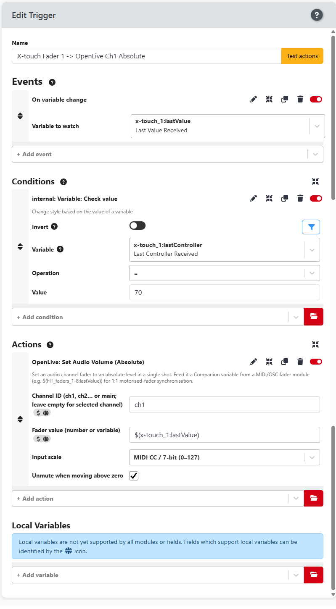
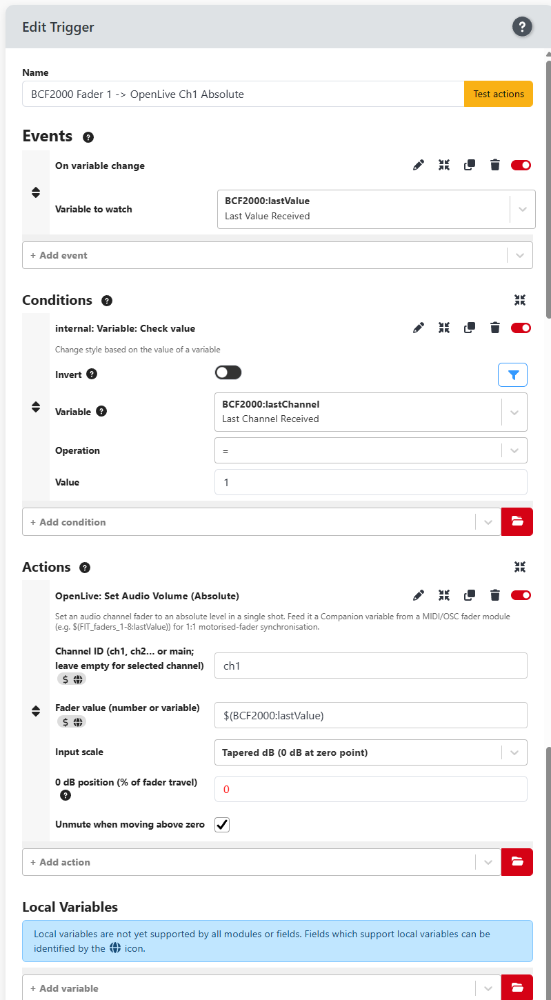

# General-MIDI fader control for Open Live

Control Open Live audio faders from a **MIDI fader surface** (motorised or not), with **1:1
synchronisation**: moving a physical fader moves Open Live, and Open Live can move the surface's
motorised faders back.

Everything runs through the Bitfocus Companion **Generic MIDI** module
(`companion-module-generic-midi`) and the Open Live module's **Set Audio Volume (Absolute)** action.

---

## Prerequisites

* Bitfocus Companion v4.x / v5.x
* The **Open Live** module (this module) connected to a running production (**control mode** —
  actions only run while a production is selected)
* The **Generic MIDI** (`generic-midi`) module installed
* A MIDI fader surface connected via USB (motorised optional)

---

## How it works — the three directions

| Direction | Mechanism |
|---|---|
| **Forward** (fader → Open Live) | Trigger watches the fader's MIDI value variable → runs **Set Audio Volume (Absolute)** |
| **Motor feedback** (Open Live → fader) | Trigger watches `$(OpenLive:ch{N}_volume)` / `$(OpenLive:ch{N}_fader_pos)` → generic-midi **Pitch Wheel / CC** moves the motor |
| **LED feedback** (Open Live → button) | Trigger watches `$(OpenLive:ch{N}_muted)` → generic-midi **Note On** (vel 127/0) lights the mute button |

The Open Live module exposes live variables for every channel:
`$(OpenLive:ch1_volume)`…`$(OpenLive:ch16_volume)`, `$(OpenLive:main_volume)` (gain, 1.0 = unity),
`$(OpenLive:ch{N}_fader_pos)` / `$(OpenLive:main_fader_pos)` (0–16383 motor position) and
`$(OpenLive:ch{N}_muted)` / `$(OpenLive:main_muted)` (true/false).

> **Dynamic variables:** the generic-midi module's `lastValue`, `lastChannel`, `lastController`,
> `lastNote`, `lastVelocity`, `lastMessage` are created **only after a MIDI message arrives**.
> Move a fader once before configuring — if a picker doesn't show them, type them manually.

---

## Common setup (applies to every surface)

1. **Add a generic-midi connection** for the surface and set its **input** (and **output**, for
   motorised faders) to the surface's MIDI ports.
2. **Move a fader** and, in the **Variables** tab, note which message carries the position
   (Pitch Bend 0–16383 or CC 0–127) and how each fader is identified (channel or controller number).
3. **Forward trigger** per fader:
   * **Event**: On variable change → `surface:lastValue`
   * **Condition**: identify the fader — `surface:lastChannel` = N **or** `surface:lastController` = X
   * **Action**: Open Live → **Set Audio Volume (Absolute)** → Channel ID `ch{N}` / `main`,
     Fader value `$(surface:lastValue)`, **Input scale** per the surface (below), Unmute checked
4. **Motor-feedback trigger** per fader (motorised surfaces):
   * **Event**: On variable change → `OpenLive:ch{N}_volume`
   * **Action**: `surface` → **Pitch Wheel** (or **CC**) → the fader's channel/controller,
     Value `$(OpenLive:ch{N}_fader_pos)` (scaled to 0–127 for 7-bit surfaces)
5. **Mute + LED triggers** per fader:
   * **Control**: event on the mute button's message → **Toggle Audio Mute** → `ch{N}`,
     filtered to the press (e.g. `lastMessage` = `noteon_1_{15+N}_127`)
   * **LED on/off**: two triggers on `$(OpenLive:ch{N}_muted)` = `true`/`false` → **Note On**
     vel `127`/`0` on the mute note

The connection's **"Fader 0 dB position (% of travel)"** setting (default `75`) drives the
**Tapered dB** scale and the `fader_pos` motor variables — set it to wherever the surface marks 0 dB.

Motor-feedback triggers for all three surfaces in this guide (Open Live → fader):


---

## Chapter 1 — Behringer X-Touch

*MCU-style surface, 8 faders + master, motorised, controllable mute LEDs.*

### MIDI layout (verified)
| Control | MIDI channel | Message |
|---|---|---|
| Fader 1 – 8 | **1** (all faders share channel 1) | **CC 70 – 77** (7-bit, 0–127) |
| Master fader | **1** | **CC 78** |
| Master touch | 1 | Note 118 |
| Mute buttons | 1 | Note 15+N (verify by pressing; MCU = 16–23) |

All faders + master are on **MIDI channel 1** — identify them by **controller number**
(`lastController` = 69+N for fader N, 78 for master), **not** by channel.

### Generic-midi connection
Add a connection (e.g. `X-Touch`) on the X-Touch's main port. (The X-Touch exposes two MIDI
ports; the faders arrive on the main one.)

### Forward triggers
* **Event**: On variable change → `X-Touch:lastValue`
* **Condition**: `X-Touch:lastController` = `70` (fader 1) … `77` (fader 8), `78` (master)
* **Action**: **Set Audio Volume (Absolute)** → `ch1`…`ch8` / `main`,
  value `$(X-Touch:lastValue)`, **Input scale: MIDI CC / 7-bit (0–127)**, Unmute checked

Example (X-Touch fader 1 → OpenLive ch1):



### Motor feedback (Open Live → X-Touch faders)
Send **CC** on the fader's controller number with the position mapped to 0–127. Because the
X-Touch is 7-bit, scale the 14-bit `fader_pos` down — e.g. an expression variable:
```
round($(OpenLive:ch1_fader_pos) / 16383 * 127)
```
then the trigger: Event `OpenLive:ch1_volume` → `X-Touch` → **CC** → Controller `70`, Value
`$(expression:…)`.

### Mute button (control + LED)
The X-Touch is the only surface in this guide whose **mute buttons have controllable LEDs**.
Each mute button is a **Note On** on channel 1 — **note 15+N** by MCU convention (fader 1 = note
16). *Press the button once and read the connection log to confirm its exact note/channel first
(this also creates the `lastMessage`/`lastNote` variables).*

**Control (button → OpenLive):** one trigger per fader
* **Event**: On variable change → `X-Touch:lastMessage`
* **Condition**: `X-Touch:lastMessage` `=` `noteon_1_{15+N}_127` *(the press only — the release
  is `..._0`, so the toggle fires once per press)*
* **Action**: Open Live → **Toggle Audio Mute** → Channel ID `ch{N}`

**LED feedback (OpenLive → button):** two triggers per fader
* **"LED on"** — Event: On variable change → `$(OpenLive:ch{N}_muted)`; Condition:
  `$(OpenLive:ch{N}_muted)` `=` `true`; Action: `X-Touch` → **Note On** → Channel `1`,
  Note `15+N`, Velocity `127`
* **"LED off"** — same Event + Condition `= false`; Action: **Note On** → Channel `1`,
  Note `15+N`, Velocity `0`

The LED follows OpenLive's mute state no matter where the mute came from (X-Touch button,
Stream Deck, or the web UI). Verified working.

---

## Chapter 2 — Behringer BCF2000

*8 motorised faders (no master), highly configurable. Faders default to 7-bit CC — for this
guide configure them to send **Pitch Bend (14-bit)** (front-panel MIDI programming or BCF2000
Edit software).*

### MIDI layout (verified with Pitch Bend enabled)
| Control | MIDI channel | Message |
|---|---|---|
| Fader 1 – 8 | **1 – 8** | **Pitch Bend** (14-bit, 0–16383) |
| Fader touch | 1 | Note 104 – 111 (104 = fader 1) |

Faders are identified by **channel** (`lastChannel` = 1–8).

### Generic-midi connection
Add a connection (e.g. `BCF2000`) on the `BCF2000` port (in and out).

### Forward triggers
* **Event**: On variable change → `BCF2000:lastValue`
* **Condition**: `BCF2000:lastChannel` = `1` … `8`
* **Action**: **Set Audio Volume (Absolute)** → `ch1`…`ch8`, value `$(BCF2000:lastValue)`,
  **Input scale: Tapered dB** (or MIDI 14-bit), Unmute checked

Example (BCF2000 fader 1 → OpenLive ch1):



### No master fader — use a fader for the main bus
The BCF2000 has no main fader, so dedicate one (e.g. **fader 8**):
* **Condition**: `BCF2000:lastChannel` = `8`
* **Action**: **Channel ID `main`** (same value/scale) — and **don't** also assign fader 8 to `ch8`.

### Motor feedback (Open Live → BCF2000 faders)
* **Event**: On variable change → `OpenLive:ch{N}_volume`
* **Action**: `BCF2000` → **Pitch Wheel** → Channel `1`–`8`, Value `$(OpenLive:ch{N}_fader_pos)`
* For `main`: Channel 8, Value `$(OpenLive:main_fader_pos)`

Verified working. (The BCF2000 reports motor-driven movement back, so if a fader oscillates add a
small dead-band in the trigger, or gate it to one direction.)

### Mute buttons
Not verified in this guide — press the mute button once and read the message from the connection
log, then use the same pattern as the X-Touch.

---

## Chapter 3 — Waves FIT (MIDIPLUS)

*16 faders + main on **two MIDI ports**, motorised, 14-bit Pitch Bend, touch-gated (motor moves
are not echoed — no loop).*

### MIDI layout (verified)
| Physical fader | Instance (port) | MIDI channel |
|---|---|---|
| 1 – 8 | `FIT_faders_1-8` (`MIDIIN2 (FIT)`) | 1 – 8 |
| 9 – 16 | `FIT_faders_9-Master` (`FIT`) | 1 – 8 |
| **Main** | `FIT_faders_9-Master` (`FIT`) | **9** |

All faders send **Pitch Bend 0–16383**. Faders are identified by channel.

### Forward triggers
* **Event**: On variable change → `FIT_faders_1-8:lastValue` (faders 1–8) /
  `FIT_faders_9-Master:lastValue` (faders 9–16 + main)
* **Condition**: `…:lastChannel` = 1–8 (faders), **9** (main)
* **Action**: **Set Audio Volume (Absolute)** → `ch1`…`ch16` / `main`, value
  `$(…:lastValue)`, **Input scale: Tapered dB (0 dB at zero point)** with **0 dB position = 75**,
  Unmute checked

Example (FIT fader 1 → OpenLive ch1):


### Motor feedback (Open Live → FIT faders)
* **Event**: On variable change → `OpenLive:ch{N}_volume`
* **Action**: the FIT instance → **Pitch Wheel** → the fader's channel, Value
  `$(OpenLive:ch{N}_fader_pos)`; main → channel 9, `$(OpenLive:main_fader_pos)`

Verified working and stable (no echo).

### Mute buttons
Mute button = **Note 15+N on channel 1**, vel 127 = press (filter the release by matching
`lastMessage` = `noteon_1_{15+N}_127`). **Note:** the FIT's mute buttons do **not** light via
MIDI — use a Companion/Stream Deck button with the `audio_muted` feedback (red) instead.

---

## Adding another surface (template)

Each surface is just: **identify its MIDI layout → one forward trigger per fader → optional
motor/LED triggers**, following the *Common setup* above. Things to record for a new surface:

1. Which MIDI port(s), and how each fader is identified (channel vs controller number)
2. Message type + range (Pitch Bend 0–16383 → **Tapered dB** / **MIDI 14-bit**; CC 0–127 →
   **MIDI CC / 7-bit**)
3. Whether the motor echoes (→ dead-band needed) and whether buttons have controllable LEDs
4. Where the fader marks 0 dB (→ "Fader 0 dB position")

Korg nanoKONTROL, DaVinci Resolve Speed Editor, Sisyfos, etc. all reduce to this checklist.

---

## Troubleshooting

| Symptom | Likely fix |
|---|---|
| Nothing changes in Open Live | Connection enabled? Production selected (control mode)? Trigger enabled? Fader moved once so the variables exist? |
| Volume snaps / wrong fader moves | Wrong condition — use `lastController` if all faders share a channel (X-Touch), `lastChannel` if per-channel (FIT/BCF2000) |
| Wrong channel affected | Verify the **Channel ID**; `ch1` = first audio channel of the production |
| Motor doesn't move | Check the surface's **receive** message/channel (BCF2000 can receive different from transmit); test with a fixed Pitch Wheel/CC value |
| Motor jitters or fights | The surface echoes motor movement — add a dead-band, or drive only one direction |
| `$(…:lastValue)` never changes | MIDI not arriving — check the port; move the fader once after (re)connecting |
