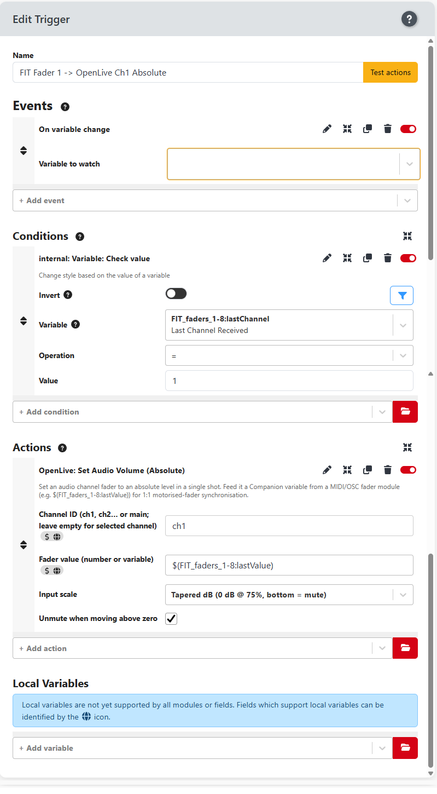

# Absolute MIDI fader control for Open Live

The complete, step-by-step setup guide for configuring **absolute 1:1 hardware fader control** in Bitfocus Companion using the new **Set Audio Volume (Absolute)** (`set_audio_volume`) action in the Open Live module.

---

## Prerequisites

* A MIDI hardware controller connected to Companion via the `generic-midi` module (e.g., **Waves FIT** on instance `FIT_faders_1-8`).
* An active **OpenLive** connection configured in Companion.

---

## Step 1: Identify Your Hardware Fader Variable

Before creating the trigger, verify the variable name generated by your MIDI controller:

1. In Companion, go to the **Variables** tab.
2. Locate your MIDI module instance (e.g., `FIT_faders_1-8`).
3. Move Fader 1 on your hardware board.
4. Observe the variable updating from **`0`** (bottom) to **`16383`** (top, for 14-bit pitch bend) or **`0–127`** (for 7-bit CC).
* *Example Variable:* `$(FIT_faders_1-8:lastValue)`
* *Example Channel Variable:* `$(FIT_faders_1-8:lastChannel)`

> **Important — the fader variables are created dynamically.** `lastValue`, `lastChannel`, `lastMsgType`
> etc. are only created by the MIDI module after it receives at least one MIDI message. Until you move a
> fader once, they do **not** exist and will not appear in any variable picker. If a picker is missing the
> variable you expect, move a fader and look again — the fields also accept manual typing
> (e.g. `FIT_faders_1-8:lastChannel`).

---

## Step 2: Create the Absolute Volume Trigger

Instead of creating separate "Up" and "Down" relative nudge triggers, a single trigger will stream the exact hardware position directly to OpenLive.

1. Go to the **Triggers** tab in Companion.
2. Click **Add Trigger** and name it (e.g., `FIT Fader 1 -> OpenLive Ch 1 Absolute`).
3. Enable the trigger (ensure the **Enable** toggle is active).

### A. Add the Event

1. Under **Events**, click **Add Event**.
2. Select **On variable change**.
3. In the **Variable** field, enter your controller's value variable:
* *Example:* `FIT_faders_1-8:lastValue`

> **⚠️ Important — the event variable must be selected.** If the **Variable** field is left empty, the
> event fires on **every** variable change in Companion, not just your fader. This is a common cause
> of erratic behaviour. After adding the event, double-check the **Variable** field shows
> `FIT_faders_1-8:lastValue` (verified working configuration: event `FIT_faders_1-8:lastValue`,
> condition `lastChannel = 1`, action as below).

### B. Add Conditions (Targeting Channel 1)

Add conditions so Fader 1 only updates Channel 1 and ignores messages from other faders on the board:

1. Under **Conditions**, click **Add Condition** and select **internal: Variable value check**.
* **Variable:** `FIT_faders_1-8:lastChannel` *(if it is not listed, move a fader first — the variables only exist after a MIDI message has been received, see Step 1; you can also type it manually)*
* **Operation:** `=`
* **Value:** `1`

*(Optional)* If you want to filter specifically for Pitch Bend messages, add a second condition for `FIT_faders_1-8:lastMsgType` `=` `pitchbend`.

### C. Add the Action

1. Under **Actions**, click **Add Action**.
2. Select **Open Live: Set Audio Volume (Absolute)** (`set_audio_volume`).
3. Configure the parameters:
* **Channel ID:** enter `ch1` (or `ch2`…`ch16` / `main`; leave empty to target the currently-selected channel).
* **Fader value (number or variable):** enter the dynamic variable expression:
```text
$(FIT_faders_1-8:lastValue)
```
* **Input scale:** select **MIDI 14-bit / Pitch Wheel (0–16383)** if using Pitch Bend, **MIDI CC / 7-bit (0–127)** if using standard CC, or **Percentage (0–100)**.
  *(The module automatically normalizes the chosen input range to OpenLive's internal `0.0–1.0` engine scale, where `1.0` = unity gain. Other scales available: **Float (0.0–1.0)**, **Decibels (−60 to 0 dB)**, **Raw gain (0.0–10.0)**, and **Tapered dB**.)*
* **Tapered dB (0 dB at zero point):** for audio faders whose 0 dB mark is above the midpoint, this maps the fader so **bottom = mute** and the fader's **0 dB mark = unity (0 dB)**, matching OpenLive's on-screen fader. When this scale is selected an extra field appears:
  * **0 dB position (% of fader travel):** where the physical fader marks 0 dB — **75** for the Waves FIT, **50** for centre-marked faders.
* **Unmute when moving above zero:** leave checked — moving the fader above the bottom takes the channel out of mute. (Moving the fader fully down mutes the strip.)

Example of a fully configured trigger (Fader 1 → OpenLive ch1):



---

## Step 3: Test and Repeat for Other Channels

1. Move Fader 1 on your physical surface.
2. Observe the OpenLive UI: the software fader now moves continuously in direct 1:1 synchronization with your hand.
3. Move the fader to the physical bottom: OpenLive snaps to `0%`.
4. Move the fader to the physical top: OpenLive snaps to `100%`.

## All 16 faders + master — verified mapping

The Waves FIT/MIDIPLUS FIT is a 16-fader + master surface that uses **two MIDI ports**,
each carrying an 8-fader bank, and emits **14-bit Pitch Bend (0–16383)** on every fader:

| Physical fader | Companion instance (port) | MIDI channel (`lastChannel`) | OpenLive Channel ID |
|---|---|---|---|
| 1 | `FIT_faders_1-8` (`MIDIIN2 (FIT)`) | 1 | `ch1` |
| 2 | `FIT_faders_1-8` (`MIDIIN2 (FIT)`) | 2 | `ch2` |
| … | `FIT_faders_1-8` (`MIDIIN2 (FIT)`) | … | … |
| 8 | `FIT_faders_1-8` (`MIDIIN2 (FIT)`) | 8 | `ch8` |
| 9 | `FIT_faders_9-Master` (`FIT`) | 1 | `ch9` |
| 10 | `FIT_faders_9-Master` (`FIT`) | 2 | `ch10` |
| … | `FIT_faders_9-Master` (`FIT`) | … | … |
| 16 | `FIT_faders_9-Master` (`FIT`) | 8 | `ch16` |
| **Master** | `FIT_faders_9-Master` (`FIT`) | **9** | `main` |

> **Important — the master is on MIDI channel 9**, not channel 1. Its trigger condition must be
> `FIT_faders_9-Master:lastChannel` **= 9**.

Create one trigger per fader (duplicate and adjust):

1. **Duplicate** the existing trigger.
2. Change the **Event** variable if it's on the other bank: faders 1–8 use `FIT_faders_1-8:lastValue`, faders 9–16 and master use `FIT_faders_9-Master:lastValue`.
3. Change the Condition **`lastChannel`** per the table (faders 9–16 use `FIT_faders_9-Master:lastChannel` = 1–8, master = 9).
4. Change the Action **Channel ID** to the matching OpenLive channel.
5. Set the Action **Input scale** to **Tapered dB (0 dB at zero point)** with **0 dB position = 75** (so bottom = mute, 0 dB mark = unity).
6. **Enable** the trigger.

---

## Master fader (main bus)

The master fader targets OpenLive's `main` channel and lives on the `FIT_faders_9-Master`
instance at **MIDI channel 9**:

| Field | Value |
|---|---|
| **Trigger name** | `FIT Master -> OpenLive Main Absolute` |
| **Event** | **On variable change** → `FIT_faders_9-Master:lastValue` |
| **Condition** | **internal: Variable value check** — Variable `FIT_faders_9-Master:lastChannel`, Operation `=`, Value `9` |
| **Action** | Open Live → **Set Audio Volume (Absolute)** |
| — **Channel ID** | `main` |
| — **Fader value** | `$(FIT_faders_9-Master:lastValue)` |
| — **Input scale** | **Tapered dB (0 dB at zero point)** |
| — **0 dB position** | `75` |
| — **Unmute when moving above zero** | checked |

*(Remember: move the master fader once before configuring so its `lastValue`/`lastChannel`
variables exist — see Step 1.)*

---

## Universal Controller Compatibility Note

While this guide uses the **Waves FIT** controller (`FIT_faders_1-8` sending 14-bit Pitch Bend values `0–16383`) as a primary example, this workflow applies to **any physical MIDI controller** mapped through Companion.

If you are using a different device (such as a Behringer X-Touch, Korg NanoKONTROL, or Stream Deck dial), simply replace `FIT_faders_1-8:lastValue` with your specific controller's variable name. As long as the controller outputs a numerical value, OpenLive will track it accurately.
