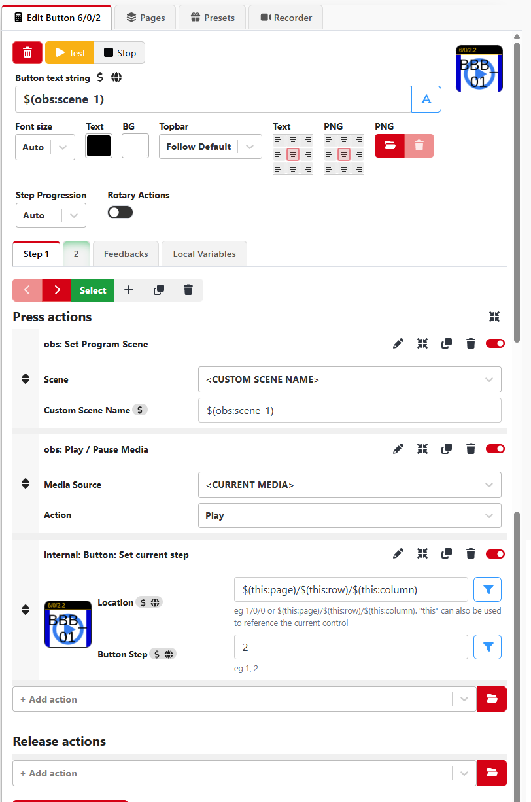
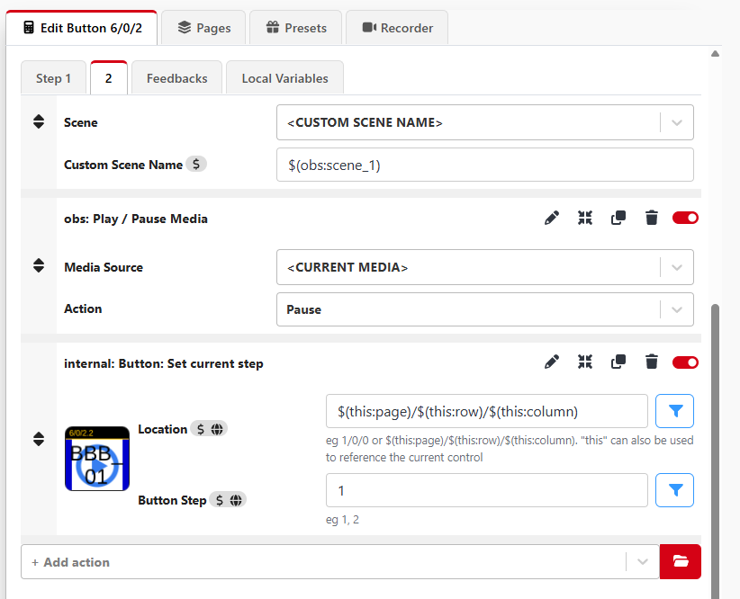
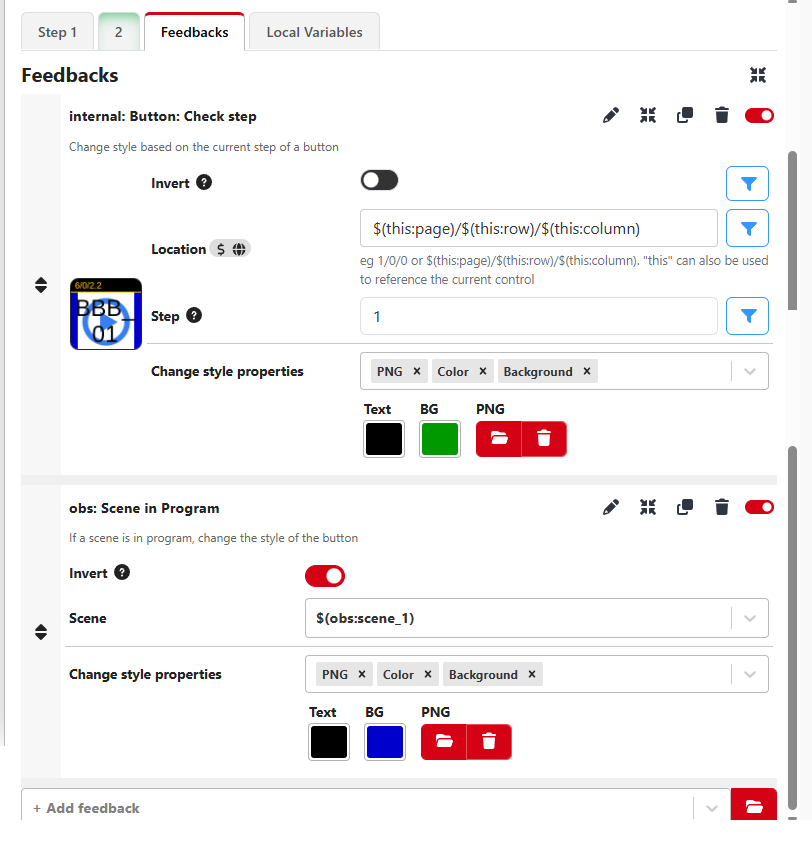

# Play OBS clips/scenes with Companion

Buttons that play a single clip in OBS. Each clip lives in its **own scene**, and one button
per clip lets you cut to that scene and start the clip. The button shows the right state at all
times:

* **PLAY** icon — the scene/clip is **not** in program
* **STOP** icon — the scene/clip is **playing**
* **PAUSE/PLAY** icon — the scene/clip is **paused** (pause again to continue)

---

## Prerequisites

### In OBS

* **Enable the WebSocket server** (Tools → WebSocket Server Settings → Enable WebSocket server).
* Add a **stream** (preferably **SRT**) as an output, and start streaming when needed.
* Put **each clip in its own scene**, and add **just that one clip** to each scene.

### In Companion

* Add **OBS** as a connection.
* Set the **server IP** (the OBS machine's IP) and the **server port**.
* If you set a password in OBS, enter it here.

---

## Setup in Companion

Create one button per clip. As the button name use the OBS **scene name variable**, e.g.:

```
$(obs:scene_1)
```

### Step 1 — play

In **Step 1** add these actions:

| Action | Settings |
|---|---|
| obs: **Set Program Scene** | Scene: **&lt;CUSTOM SCENE NAME&gt;** → Custom Scene name: `$(obs:scene_1)` |
| obs: **Play / Pause Media** | Media source: **&lt;your media/clip source&gt;** → Action: **Play** |
| internal: **Button: Set current step** | Location: `$(this:page)/$(this:row)/$(this:column)` → Button Step: `2` |



### Step 2 — pause

In **Step 2** add these actions:

| Action | Settings |
|---|---|
| obs: **Set Program Scene** | Scene: **&lt;CUSTOM SCENE NAME&gt;** → Custom Scene name: `$(obs:scene_1)` |
| obs: **Play / Pause Media** | Media source: **&lt;your media/clip source&gt;** → Action: **Pause** |
| internal: **Button: Set current step** | Location: `$(this:page)/$(this:row)/$(this:column)` → Button Step: `1` |



### Feedbacks

Add these feedbacks to show the correct icon:

| Feedback | Settings | Background |
|---|---|---|
| internal: **Button: Check step** | Location: `$(this:page)/$(this:row)/$(this:column)` → Button Step: `2` | **STOP** icon |
| internal: **Button: Check step** | Location: `$(this:page)/$(this:row)/$(this:column)` → Button Step: `1` | **PAUSE/PLAY** icon |
| obs: **Scene in Program** (inverted) | Scene: `$(obs:scene_1)` → **Invert** enabled | **PLAY** icon |

The **Scene in Program** feedback is **inverted**, so the PLAY icon shows whenever the scene is
*not* in program. The step feedbacks then take over while it is in program (STOP while playing,
PAUSE/PLAY while paused).



### Repeat for more clips

Duplicate the button for each additional clip/scene, changing:

* The **scene name variable** (e.g. `$(obs:scene_2)`, `$(obs:scene_3)`, …)
* The **Custom Scene name** and the **media source** to match each clip

---

## Button icons

The three button-icon images used by the feedbacks above:

| Icon | Image |
|---|---|
| PLAY |  |
| PAUSE/PLAY |  |
| STOP |  |

---

## Notes

* The button name uses `$(obs:scene_N)` so it always shows the current scene name.
* Pressing a **playing** button pauses (step 2), pressing a **paused** button resumes (step 1);
  the icons update automatically via the feedbacks.
